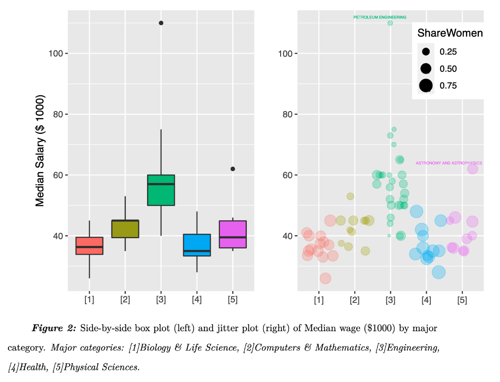

# Gender Wage Inequality in STEM

Do we choose our career path based on gender-based social roles or based on top salary? Although many countries, such as China, have incorporated women into their labor power to become a powerful economy, women still choose careers that are more in sync to gender stereotype. 

Undoubtedly, personality characteristics associated with women, are sympathy, kindness, and warmth, and reflect a concern about other people. However, the traits associated to men are achievement orientation and ambitiousness, and concern about accomplishing tasks. These characteristics are very noticeable in the stereotypical association of men in the worker role and women in the family role. 

More schools are encouraging girls to enter STEM programs and provided them with many resources to succeed in these types of careers. Despite these efforts, women tend to choose career where the median pay is lower.

# Research Goals

Our research question tries to find associations within STEM college majors that influence median wages. Our goals are to explore the data for STEM college majors and to create a predictive model for median wages.

# Dataset Used

To address this problem, we used a subset of the College Majors dataset from FiveThirthyEight, found here: https://github.com/fivethirtyeight/data/blob/master/college-majors/women-stem.csv

# Tools Used

* Packages: dplyr, ggplot2, ggpubr, scales, MASS, car, lmtest
* Statistical Tests & Analyses: Box-Cox, Step-wise selection, Shapiro-Wilks, ANOVA

# Video Presentation 

R4DS Online Learning Community Ggplot2 Book Club; May 9, 2022: https://www.youtube.com/watch?v=ihl-15wL7zY
